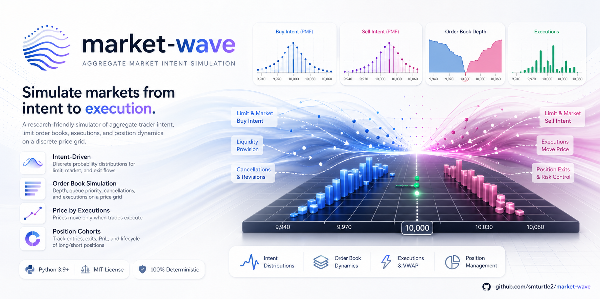
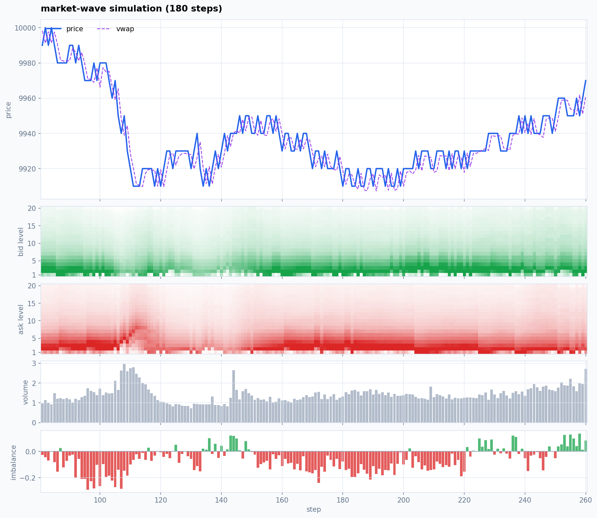

# market-wave

<p align="center">
  
</p>

<p align="center">
  <strong>relative tick 의도 PMF로 빠르고 가벼운 synthetic market data를 만듭니다.</strong>
</p>

<p align="center">
  <a href="https://pypi.org/project/market-wave/"></a>
  <a href="https://pypi.org/project/market-wave/"></a>
  <a href="LICENSE"></a>
  <a href=".github/workflows/workflow.yml"></a>
</p>

<p align="center">
  <a href="README.md">English</a> | 한국어
</p>

`market-wave`는 개별 참여자를 만들지 않고 시장 전체의 진입 가격과 탈출 가격
의도로 synthetic market path를 만드는 Python 라이브러리입니다. 집계된 매수/매도
압력, 포지션 청산, 호가창 깊이, 주문 취소, taker flow, 체결 기반 가격 변화를
relative tick 위의 확률질량으로 다룹니다.

이 라이브러리는 가격 예측 모델이 아닙니다. 실험, 시각화, 교육, 전략 환경
프로토타이핑을 위한 가벼운 시뮬레이션 도구입니다.

## 왜 market-wave인가?

- **개별 agent가 아닌 집계 의도**: 참여자 객체를 만들지 않고 relative tick별 확률질량으로
  시장 의도를 표현합니다.
- **relative tick PMF**: 진입/탈출 압력을 `P(relative_tick)`으로 모델링한 뒤 현재
  `price_grid`에 투영합니다.
- **교체 가능한 분포 모델**: `LaplaceMixturePMF`, `SkewedPMF`, `FatTailPMF`,
  `NoisyPMF` 또는 custom model로 PMF 생성부만 바꿀 수 있습니다.
- **분포와 거래강도 분리**: PMF는 의도가 어느 가격대에 있는지, intensity는 총
  주문량이 얼마나 되는지를 담당합니다.
- **체결 기반 가격**: 체결이 없으면 가격은 움직이지 않습니다.
- **batch generation**: 많은 synthetic path를 만들 때 `market.history`를 계속
  쌓지 않고 재현 가능한 경로를 생성할 수 있습니다.
- **관찰 가능한 상태**: 매 step마다 PMF, 거래량, 호가창, 포지션 mass, VWAP,
  spread, imbalance가 담긴 `StepInfo`를 반환합니다.
- **내장 시각화**: `matplotlib` 기반의 깔끔한 light chart 스타일을 제공합니다.

## 설치

```bash
pip install market-wave
```

로컬 개발:

```bash
git clone https://github.com/smturtle2/market-wave.git
cd market-wave
uv sync --extra dev
```

Python `>=3.10`을 지원합니다.

## 빠른 시작

```python
from market_wave import Market

market = Market(
    initial_price=10_000,
    gap=10,
    popularity=1.0,
    seed=42,
    regime="auto",
    augmentation_strength=0.25,
)
steps = market.step(500)

last = steps[-1]
print(last.price_before, "->", last.price_after)
print("executed:", round(last.total_executed_volume, 3))
print("imbalance:", round(last.order_flow_imbalance, 3))
print("crossed flow:", round(last.crossed_market_volume, 3))
print("residual flow:", round(last.residual_market_buy_volume, 3), round(last.residual_market_sell_volume, 3))
```

`Market.step(n)`은 항상 `list[StepInfo]`를 반환하고, 같은 객체들을
`market.history`에 저장합니다.

대량 생성에서는 history 저장을 끌 수 있습니다.

```python
steps = market.step(512, keep_history=False)

for step in market.stream(512, keep_history=False):
    consume(step)
```

간단한 export에는 `step.to_dict()`, `step.to_json()`,
`market.history_records()`를 사용할 수 있습니다.

`seed=42` 기준 예시 출력:

```text
10030.0 -> 10030.0
executed: 1.03
imbalance: 0.054
crossed flow: 0.693
residual flow: 0.215 0.122
```

## 스모크 매트릭스

고정 seed에서는 결정적으로 동작하므로, 서로 다른 시장 조건에 같은 invariant를
쉽게 적용할 수 있습니다.

```python
from market_wave import Market

cases = [
    ("baseline", dict(initial_price=10_000, gap=10, popularity=1.0, seed=42, grid_radius=20), 500),
    ("busy", dict(initial_price=10_000, gap=10, popularity=2.5, seed=7, grid_radius=24), 500),
    ("thin", dict(initial_price=500, gap=5, popularity=0.25, seed=123, grid_radius=12), 500),
    ("low_price", dict(initial_price=1, gap=1, popularity=3.0, seed=17, grid_radius=8), 500),
    ("inactive", dict(initial_price=100, gap=1, popularity=0.0, seed=9, grid_radius=10), 100),
]

for name, kwargs, steps_count in cases:
    market = Market(**kwargs)
    steps = market.step(steps_count)
    prices = [step.price_after for step in steps]
    move_steps = sum(step.price_change != 0 for step in steps)
    exec_steps = sum(step.total_executed_volume > 0 for step in steps)
    print(name, min(prices), max(prices), move_steps, exec_steps, market.state.price)
```

현재 구현에서 최근 검증한 결과:

```text
baseline   range= 9930.0-10010.0 moves=235 exec_steps=500 final= 9950.0
busy       range= 9920.0-10010.0 moves=248 exec_steps=500 final= 9950.0
thin       range=  470.0-500.0   moves=242 exec_steps=500 final=  475.0
low_price  range=    1.0-3.0     moves=236 exec_steps=500 final=    1.0
inactive   range=  100.0-100.0   moves=  0 exec_steps=  0 final=  100.0
```

이 실행들은 현재 state의 PMF가 `state.price_grid`와 정렬되는지, PMF가 정규화되는지,
가격이 한 tick 아래로 내려가지 않는지, order book과 position mass가 음수가
아닌지, 가격 변화가 체결량이 있는 step에서만 발생하는지도 함께 확인했습니다.

## 시각화

```python
from market_wave import Market

market = Market(initial_price=10_000, gap=10, popularity=1.0, seed=42)
market.step(260)

fig, ax = market.plot(last=180)
```

<p align="center">
  
</p>

기본 `market_wave` 스타일은 가격/VWAP, 단순 level 기준 bid/ask orderbook depth
heatmap, 체결량, order-flow imbalance를 함께 보여주는 light multi-panel 차트입니다.
예전 3-panel 화면은 `orderbook=False`로 볼 수 있습니다.

Dark overlay 모드도 사용할 수 있습니다.

```python
fig, ax = market.plot(layout="overlay", style="market_wave_dark")
```

## Synthetic Data

```python
from market_wave import compute_metrics, generate_paths

paths = generate_paths(
    n_paths=100,
    horizon=512,
    config_sampler=lambda path_id: {
        "initial_price": 10_000,
        "gap": 10,
        "popularity": 1.0,
        "seed": 10_000 + path_id,
        "regime": "auto",
        "augmentation_strength": 0.35,
    },
)

metrics = compute_metrics(paths)
print(metrics.return_std, metrics.volume_mean, metrics.max_drawdown)
print(paths[0].metadata.config_hash)
```

`GeneratedPath.metadata`에는 `seed`, `config_hash`, package `version`, `regime`,
`augmentation_strength`가 저장되어 synthetic run을 추적할 수 있습니다. Pandas는
optional입니다. `to_dataframe()`을 쓰려면 `market-wave[dataframe]`으로 설치하세요.

## 교체 가능한 PMF

```python
from market_wave import FatTailPMF, Market, NoisyPMF

market = Market(
    initial_price=100,
    gap=1,
    distribution_model=NoisyPMF(FatTailPMF()),
    augmentation_strength=0.5,
    seed=7,
)

step = market.step(1)[0]
print(step.relative_ticks)
print(step.buy_entry_pmf_by_tick)
```

Custom model은 메서드 하나만 구현하면 됩니다.

```python
class MyPMF:
    def pmf(self, side, intent, relative_ticks, context):
        weights = [1.0 / (1.0 + abs(tick)) for tick in relative_ticks]
        total = sum(weights)
        return [weight / total for weight in weights]
```

## 핵심 개념

매 step마다 현재 가격 주변의 relative tick 그리드를 만듭니다.

```text
relative_tick = (price - current_price) / tick_size
relative_ticks = [-grid_radius, ..., 0, ..., +grid_radius]
```

시뮬레이터는 이 relative grid 위에 네 개의 확률질량함수를 유지합니다.

- `buy_entry_pmf`
- `sell_entry_pmf`
- `long_exit_pmf`
- `short_exit_pmf`

각 PMF는 정규화된 이산 혼합분포입니다.

```text
pmf[tick] = sum(component_weight * kernel(tick, center_tick, spread_ticks))
kernel(tick, center, spread) proportional to exp(-abs(tick - center) / spread)
```

이 relative PMF는 호가 형성을 위해 `price_grid = current_price +/- k * gap`에
투영됩니다. `pmf_inertia`는 시장 의도가 갑자기 튀지 않게 합니다.

```text
pmf_t = pmf_inertia * pmf_prev + (1 - pmf_inertia) * pmf_new
```

PMF는 집계 의도를 만들고, intensity는 총 주문량을 결정합니다. 호가창/체결
레이어는 이를 limit flow, taker flow, 주문 취소, 청산, 체결량, 가격 변화로
바꿉니다.

## 체결 보장

가격 변화는 체결에 의해 발생합니다.

- 해당 step의 체결량이 없으면 `price_after == price_before`입니다.
- 체결이 있으면 `price_after`는 해당 step의 체결 통계에서 계산됩니다. bounded
  quote jitter는 보조 역할만 하며, 이전 가격에서만 체결된 경우 혼자 가격을
  움직이지 않습니다.
- 같은 버전과 같은 입력에서 `seed`는 재현 가능한 시뮬레이션을 만듭니다.

이 라이브러리는 시장 데이터 replay 엔진이 아니며, 금융 조언도 아닙니다.

## API 개요

```python
from market_wave import (
    Market,
    LaplaceMixturePMF,
    SkewedPMF,
    FatTailPMF,
    NoisyPMF,
    generate_paths,
    compute_metrics,
    MarketState,
    IntensityState,
    LatentState,
    MixtureComponent,
    DiscreteMixtureDistribution,
    DistributionState,
    OrderBookState,
    PositionMassState,
    StepInfo,
)
```

자주 보는 `StepInfo` 필드:

- `price_before`, `price_after`, `price_change`
- `tick_before`, `tick_after`, `tick_change`, `relative_ticks`
- `buy_entry_pmf`, `sell_entry_pmf`, `long_exit_pmf`, `short_exit_pmf`
- `buy_entry_pmf_by_tick`, `sell_entry_pmf_by_tick`
- `buy_volume_by_price`, `sell_volume_by_price`
- `executed_volume_by_price`, `total_executed_volume`, `trade_count`
- `market_buy_volume`, `market_sell_volume`, `crossed_market_volume`
- `residual_market_buy_volume`, `residual_market_sell_volume`
- `vwap_price`, `best_bid_before`, `best_ask_before`, `spread_after`
- `orderbook_before`, `orderbook_after`
- `position_mass_before`, `position_mass_after`

## 개발

```bash
uv sync --extra dev
uv run ruff check .
uv run pytest
uv build
```

## 라이선스

MIT
